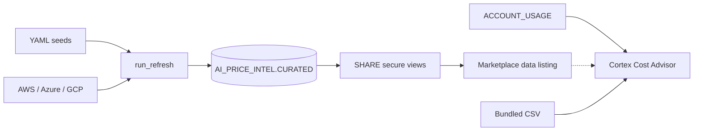

# AI Model & Compute Price Intelligence + Cortex Cost Advisor

[](.github/workflows/ci.yml)
[](.github/workflows/weekly_refresh.yml)
[](LICENSE)
[](pyproject.toml)

Two Snowflake Marketplace products in one monorepo:

1. **AI Model & Compute Price Intelligence** — weekly dataset (LLM/GPU/Cortex prices + history)
2. **Cortex Cost Advisor** — free, read-only Native App (Streamlit) for Cortex spend & switch scenarios

Assumptions and deferred scope: [`DECISIONS.md`](DECISIONS.md).  
Architecture: [`docs/ARCHITECTURE.md`](docs/ARCHITECTURE.md).  
Listing copy: [`docs/LISTING_COPY.md`](docs/LISTING_COPY.md).  
Publish steps: [`docs/PUBLISHING_RUNBOOK.md`](docs/PUBLISHING_RUNBOOK.md).

## Architecture



## Screenshot placeholders

| Surface | Placeholder |
|---|---|
| Dataset — current model prices | `docs/screenshots/dataset-model-current.png` *(add before publish)* |
| Dataset — cost per MMLU point | `docs/screenshots/cost-per-mmlu.png` |
| App — Overview | `docs/screenshots/app-overview.png` |
| App — Model Advisor | `docs/screenshots/app-model-advisor.png` |

## Quickstart

```bash
# Requires Python 3.11
make setup
make test
make dry-run   # seeds → /tmp/ai_price_intel/<run_id>/*.parquet (no Snowflake)

# With Snowflake key-pair env vars set (see .env.example + runbook):
make deploy-warehouse
make refresh
make deploy-app   # snow app run inside native_app/
```

### Environment variables

| Variable | Required for | Notes |
|---|---|---|
| `SNOWFLAKE_ACCOUNT` | deploy / refresh | Account locator |
| `SNOWFLAKE_USER` | deploy / refresh | Key-pair user |
| `SNOWFLAKE_PRIVATE_KEY_PATH` | deploy / refresh | PEM/P8 path |
| `SNOWFLAKE_WAREHOUSE` | optional | Default `COMPUTE_WH` |
| `SNOWFLAKE_ROLE` | optional | Default `AI_PRICE_ADMIN` |

## Repository layout

See the tree in the product brief — key entrypoints:

- `python -m ingestion.run_refresh[--dry-run][--skip-cloud]`
- `warehouse/deploy.py`
- `native_app/` (`snow app run`)

## Security posture (Native App)

- Privilege: **Imported Privileges on SNOWFLAKE DB** (+ optional dataset view references)
- Reads current Cortex AI usage views (not deprecated `CORTEX_FUNCTIONS_USAGE_HISTORY`; not `QUERY_HISTORY`)
- No external access, network, containers, telemetry, or secrets in code
- Un-obfuscated Python; dependencies declared in `environment.yml`

## Before Marketplace publish

1. Human-verify YAML seeds (`# VERIFY BEFORE FIRST PUBLISH`)
2. Replace `YOURDOMAIN` / `YOUR_ORG` placeholders in listing docs
3. Add screenshots under `docs/screenshots/`
4. Private-share to a second account and click **Refresh usage views** after granting privileges

## License

Apache-2.0 — see [LICENSE](LICENSE).
