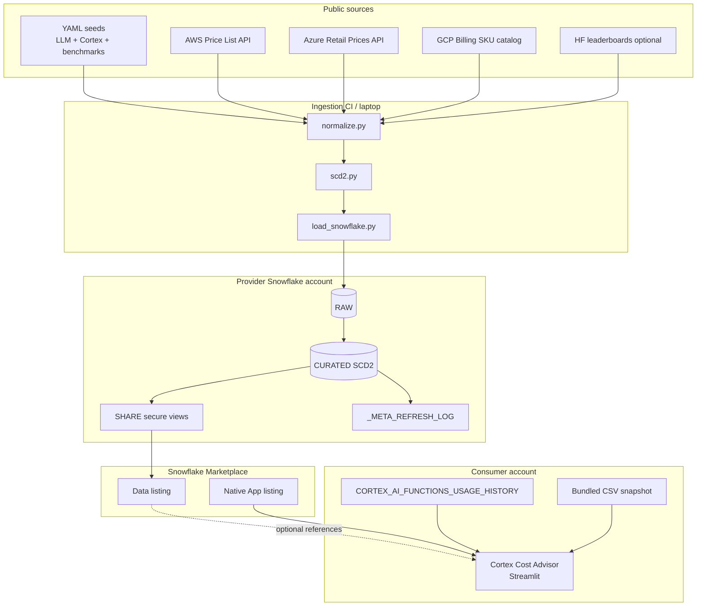

# Architecture

## Products

1. **AI Model & Compute Price Intelligence** — weekly-refreshed Marketplace **data listing** (SHARE of secure views).
2. **Cortex Cost Advisor** — free, read-only Native App (Streamlit) that joins consumer `ACCOUNT_USAGE` to the dataset (or a bundled snapshot).

## Data model (CURATED)

Star-ish schema with SCD2 on price facts:

| Object | Role |
|---|---|
| `DIM_PROVIDER` / `DIM_MODEL` / `DIM_GPU_INSTANCE` | Dimensions |
| `FACT_MODEL_PRICE_HISTORY` | SCD2 LLM/embedding USD per 1M tokens |
| `FACT_GPU_PRICE_HISTORY` | SCD2 GPU USD per GPU-hour |
| `FACT_CORTEX_PRICE_HISTORY` | SCD2 Cortex credits per 1M tokens |
| `FACT_BENCHMARK_SCORE` | Latest-wins benchmark scores |
| `VW_*` | Current prices, 90d changes, cost-per-MMLU-point |
| `_META_REFRESH_LOG` | Freshness trust signal |

`SHARE.*` mirrors consumer-facing objects as **secure views** only.

## Native app privilege boundary

- Requests `IMPORTED PRIVILEGES ON SNOWFLAKE DB` plus optional view **references** for the dataset.
- Uses `CORTEX_AI_FUNCTIONS_USAGE_HISTORY` (fallback `CORTEX_AISQL_USAGE_HISTORY`); never deprecated Cortex usage views; never `QUERY_HISTORY`.
- `ENSURE_ACCOUNT_USAGE_VIEWS()` recreates wrappers after privilege grant (also invoked from Streamlit).
- No external access, external functions, network, SPCS, or telemetry.
- SQL capped at 90 days; all queries live in `queries.py`.

## Refresh path

GitHub Action (Mondays 06:00 UTC) → `python -m ingestion.run_refresh` → quality checks → non-zero exit on failure (job log only; no webhooks).
